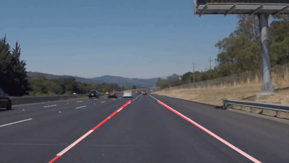
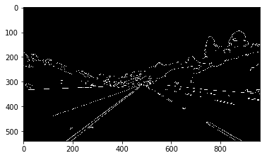
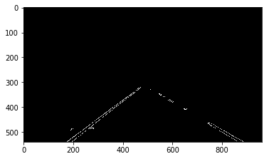
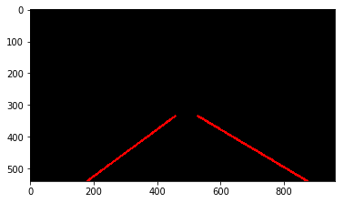
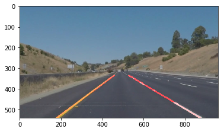

**Finding Lane Lines on the Road**

The goals / steps of this project are the following:
* Make a pipeline that finds lane lines on the road
* Reflect on your work in a written report

###### Code can be found in P1.ipynb

###### Final output. (More video outputs can be found in the output folder.) 
  

### Reflection

###1. Lane Finding Pipeline

Each frame from the the video looks something like this. 

   

Then we apply the steps below to detect lane lines

1. Gray scale the image to help filter out noise for edge detection
  
  

2. Do canny edge detection to identify all edges
  
  

3. Find Region of Interests for filter out un-wanted edges
  
  

4. Hough Transform to identify x, y values of each line detected
5. Average left and right line slopes then extrapolate lane lines. To do this I seperated the right and left lines by identifying the slope of each line (look in draw_lines() method)
  
  

6. Draw in lane lines with thicker weights and apply to original image
  
  

###2. Identify potential shortcomings with your current pipeline

A potential shortcoming is that the region of interests is not dynamic. This can cause the algorithm to detect unwanted lines
that could be far from the actual lane lines. I made the region of interests as wide as possible just to it can detect the
actual lange line when it needs to.

Another potential shortcoming is that there are some x, y vaules of the line given from Hough Transform to be Nan. This causes 
the lane line to not be detected therefore there are moments where the lane line was not detected. 

###3. Suggest possible improvements to your pipeline

The values of the hough transform (rho, theta, threshold, minimum line lengh, max line gap) could be tweaked better to be 
optimized. Also if the region of interest is dynamic, it would also filter out un-wanted lines. 
